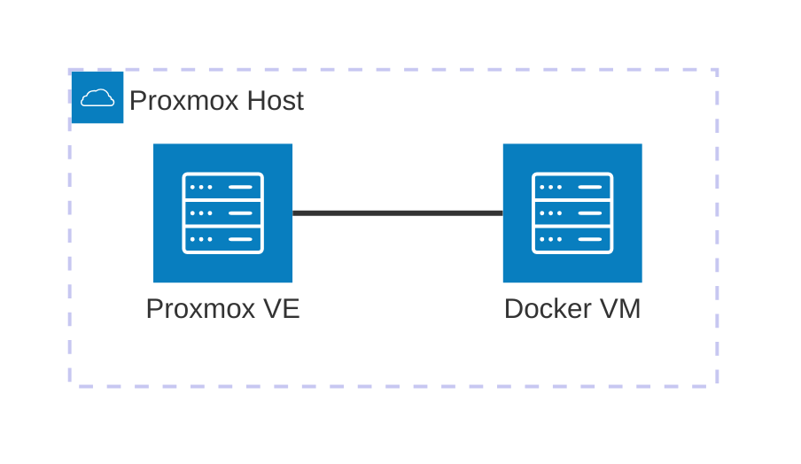

# Casa Mia Network Infrastructure

This repository holds the infrastructure configuration for the Docker VM (`192.168.0.136`), part of the [Casa Mia Network](https://github.com/AlexSzczygielski/casa-mia-network) homelab — see that repo for network topology, IP allocation, and node-level architecture. This repo covers what actually *runs* on the Docker VM specifically.

**[Online docs](https://alexszczygielski.github.io/casa-mia-net-infrastructure/)** — same content as the READMEs in this repo, published via GitHub Pages.

## Where this runs

Everything in this repo runs in the Docker VM, which itself is a VM hosted on the Proxmox node.



## Configuration philosophy

This repository favors declarative, file-based configuration over
imperative changes made through a service's web UI. Configuration is
version-controlled and reproducible from a clean checkout; where a
service's UI is the only viable mechanism for a given setting, that
exception is documented explicitly in the service's own README rather than
treated as the norm. Secrets are the sole deliberate exception to this
principle — see the `.env` convention below.

## Repo structure

One folder per service, each with its own `docker-compose.yml`. A folder is the unit of deployment — anything that needs to start, stop, or be torn down together lives in the same folder.

```bash
casa-mia-net-infrastructure/
├── docker-compose.yml # root compose
├── portainer/
│   ├── docker-compose.yml # service compose
│   └── README.md
└── .../
```

## Data storage convention

Any service with persistent data uses a **bind mount**, rooted at:

```
/opt/docker-data/<service-name>/
```

Bind mounts under one known root mean the whole stack's data can be backed up from a single path (`/opt/docker-data`).

## Adding a new service

1. Add a new folder with its own `docker-compose.yml`. Start the file with a comment denoting what service this is:
    ```
    # docker-compose.yml (service-name)
    ```
2. **If it has persistent data:** check the image's docs for which internal path it writes to (e.g. Uptime Kuma → `/app/data`, Postgres → `/var/lib/postgresql/data`), and whether it runs as root or a specific non-root user (often a UID, or `PUID`/`PGID` env vars).
   - **Root, or doesn't care about ownership:** nothing to pre-create — Docker auto-creates `/opt/docker-data/<service-name>` on first start, owned by root. Fine for services like Portainer.
   - **Non-root user:** pre-create and set ownership *before* first start, so the container isn't fixing permission errors on data it already partially wrote:
     ```bash
     sudo mkdir -p /opt/docker-data/<service-name>
     sudo chown -R <uid>:<gid> /opt/docker-data/<service-name>
     ```
   - Mount it per the [Data storage convention](#data-storage-convention) above. No top-level `volumes:` block for named volumes — bind mounts only.
   - If the container logs permission errors anyway, double check the UID/GID against the image's docs — some expect ownership to match a specific number, not just "any non-root."
3. **If it needs to be reachable via a domain**: add a site block to [Caddy's Caddyfile](https://github.com/AlexSzczygielski/casa-mia-net-infrastructure/blob/main/caddy/README.md) — `<service>.casamia-net.top` for LAN, `<service>.ts.casamia-net.top` for Tailscale, proxying to the service's **container-internal** port (not its host-published one, if it has one — see [Caddy's README](https://github.com/AlexSzczygielski/casa-mia-net-infrastructure/blob/main/caddy/README.md) for more info).
   - **No Pi-hole change needed** — the existing wildcard already resolves any subdomain under both domains automatically. Pi-hole only needs touching if the domain structure itself changes, not per new service.
4. Add a line for the new service under `include:` in the root `docker-compose.yml`.

## Deploying

The root `docker-compose.yml` uses Compose's `include:` directive to pull in every service's own compose file, so the whole stack deploys from one place:

```bash
git pull
docker compose up -d
```

This is safe to re-run anytime — Compose only recreates a container if its config actually changed, so this doubles as the update command.

> [!IMPORTANT]
> **Always deploy from the root, not from inside a service folder.** Services
> reach each other by container name over Compose's shared default network
> (e.g. Caddy proxying to `vaultwarden:80`) — that network only exists
> because everything is brought up as one project via the root `include:`.
> Running `docker compose up -d` from inside a single service folder creates
> a separate, isolated project instead, breaking name resolution for every
> other service until it's redeployed from root.
>
> Redeploying just one service is still fine *from the root*:
> ```bash
> docker compose up -d --force-recreate <service>
> ```
> Only recreates that one container — everything else, and the shared
> network, stays untouched.