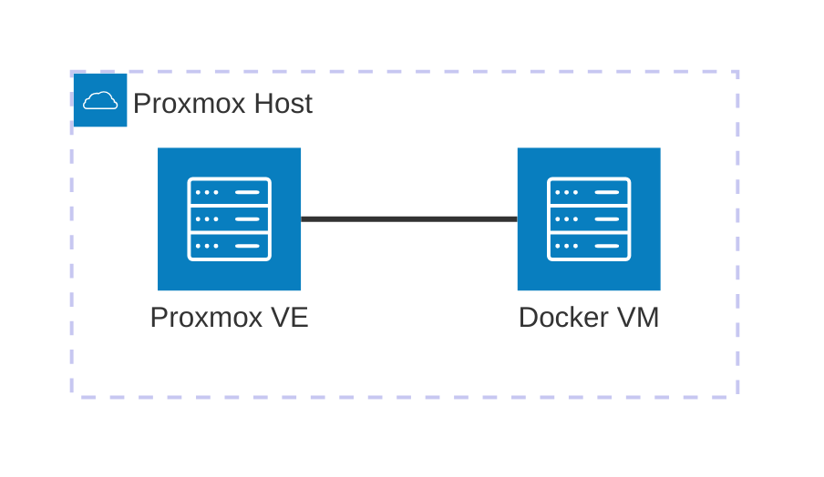

# Casa Mia Network Infrastructure

This repository holds the infrastructure configuration for the Docker VM (`192.168.0.136`), part of the [Casa Mia Network](https://github.com/AlexSzczygielski/casa-mia-network) homelab.

## Where this runs

Everything in this repo runs in the Docker VM, which itself is a VM hosted on the Proxmox node.



## Repo structure

One folder per service, each with its own `docker-compose.yml`. A folder is the unit of deployment — anything that needs to start, stop, or be torn down together lives in the same folder.

```bash
casa-mia-net-infrastructure/
├── docker-compose.yml # root compose
├── portainer/
│   ├── docker-compose.yml # service compose
│   └── README.md
└── .../
```

## Data storage convention

Any service with persistent data uses a **bind mount**, rooted at:

```
/opt/docker-data/<service-name>/
```

Bind mounts under one known root mean the whole stack's data can be backed up from a single path (`/opt/docker-data`).

## Adding a new service:

1. Check the image's docs (Docker Hub page / GitHub README) for which internal path it writes persistent data to (e.g. Uptime Kuma → `/app/data`, Postgres → `/var/lib/postgresql/data`). Also check whether the image runs as root or a specific non-root user (often documented as a UID, or via `PUID`/`PGID` env vars) — this determines whether step 2 is needed.
2. **If the image runs as root, or doesn't care about ownership:** skip ahead — Docker will auto-create `/opt/docker-data/<service-name>` on first start, owned by root. This is fine for services like Portainer.
   **If the image runs as a non-root user:** pre-create and set ownership before first start, so the container isn't fixing permission errors on data it already partially wrote:
    ```bash
    sudo mkdir -p /opt/docker-data/<service-name>
    ```
    ```bash
    sudo chown -R <uid>:<gid> /opt/docker-data/<service-name>
    ```
3. Mount it in the service's `docker-compose.yml`:
    ```yaml
    volumes:
        - /opt/docker-data/<service-name>:<path the image expects>
    ```
4. Do **not** add a top-level `volumes:` block for a named volume — bind mounts only.
5. If the container logs permission errors on startup despite the above, double check the UID/GID against the image's docs — some images expect ownership to match a specific number, not just "non-root."

**Permissions note:** Docker will silently create the host directory as root-owned if it doesn't already exist. Most containers are fine with this or run as root internally (e.g. Portainer). If a container logs permission errors on startup, either `chown` the directory to match the UID the image's docs specify, or check for a `PUID`/`PGID` environment variable (common on LinkedIn-Arr/LSIO-style images).

## Adding a new service

1. Add a new folder with its own `docker-compose.yml`
Start `.yml` with a comment denoting what service this is
    ```
    # docker-compose.yml (service-name)
    ```
2. Set up its data directory per the [Data storage convention](#data-storage-convention) above, if it has persistent data
3. Add a line for it under `include:` in the root `docker-compose.yml`

## Deploying

The root `docker-compose.yml` uses Compose's `include:` directive to pull in every service's own compose file, so the whole stack deploys from one place:

```bash
git pull
docker compose up -d
```

This is safe to re-run anytime — Compose only recreates a container if its config actually changed, so this doubles as the update command.