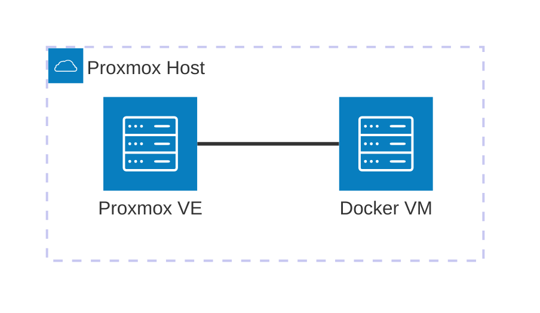

# Casa Mia Network Infrastructure

This repository holds the infrastructure configuration for the Docker VM (`192.168.0.136`), part of the [Casa Mia Network](https://github.com/AlexSzczygielski/casa-mia-network) homelab.

## Where this runs

Everything in this repo runs in the Docker VM, which itself is a VM hosted on the Proxmox node.



## Repo structure

One folder per service, each with its own `docker-compose.yml`. A folder is the unit of deployment — anything that needs to start, stop, or be torn down together lives in the same folder.

```bash
casa-mia-net-infrastructure/
├── docker-compose.yml # root compose
├── portainer/
│   ├── docker-compose.yml # service compose
│   └── README.md
└── .../
```

## Adding a new service:
1. Add a new folder with its own `docker-compose.yml`
2. Add a line for it under `include:` in the root `docker-compose.yml`

## Deploying

The root `docker-compose.yml` uses Compose's `include:` directive to pull in every service's own compose file, so the whole stack deploys from one place:

```bash
git pull
docker compose up -d
```

This is safe to re-run anytime — Compose only recreates a container if its config actually changed, so this doubles as the update command.